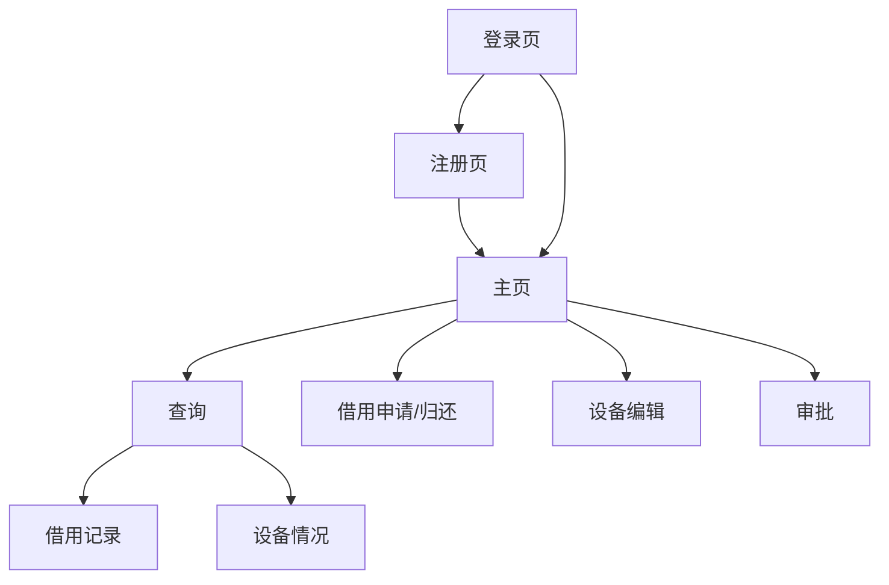

# 实验设备管理系统

[](https://opensource.org/licenses/MIT)

一个用于管理实验设备的系统。使用MySQL数据库、Flask后端以及基于HTML、CSS和JavaScript构建的轻量级Web界面。

## 功能

1. 用户管理模块
    1. 多类型用户：
        - 学生、教师、管理员
        - 注册与登录
    2. 密码存储：加密存储，数据库存储哈希值而非明文
    3. 用户信息管理：
        - 学生可以更新密码、联系方式、专业等，不可变更ID、性别
        - 教师可以更新密码、联系方式、职称等，不可变更ID、性别
        - 管理员可以按条件删除学生账号（例如毕业生）、删除教师账号（例如离职教师）、变更数据（例如转专业的学生）
2. 设备管理模块
    1. 录入新设备：
        - 设备名称、型号、购入时间、价格、状态（正常/需要维修/维修中/报废）、所属实验室（例如大数据实验室、化学实验室）、能否借用（是/否）等
    2. 查询设备：
        - 按上述字段查询设备
    3. 编辑设备信息：
        - 例如维修时，能否借用项需要置否，状态更改为维修中
        - 报废的设备需要删除
        - 此项必须由教师或管理员更改，学生无权更改
3. 设备借还模块（借还状态需要记载于用户字段下）：
    1. 学生申请使用
    2. 教师审批
    3. 学生归还（不经过审批）


## 数据库设计

### 1. `users` 表

> 存放全部用户数据

```plaintext
user_id          INT AUTO_INCREMENT PRIMARY KEY, -- 用户唯一标识
username         VARCHAR(50) NOT NULL,           -- 用户名，用于登录
pswd_hash        VARCHAR(255) NOT NULL,          -- 加密后的密码哈希值
user_type        INT NOT NULL,                   -- 用户类型（1: 学生, 2: 教师, 3: 管理员）
name             VARCHAR(100) NOT NULL,          -- 用户姓名
gender           INT NOT NULL,                   -- 性别（1: 男, 2: 女）
dpt              VARCHAR(100),                   -- 所属院系或专业
title            VARCHAR(100),                   -- 职称
status           INT NOT NULL                    -- 用户状态（1: 正常, 2: 毕业, 3: 离职等）
```

### 2. `devices` 表

> 存放全部设备数据

```plaintext
device_id        INT AUTO_INCREMENT PRIMARY KEY, -- 设备唯一标识
device_name      VARCHAR(100) NOT NULL,          -- 设备名称
model            VARCHAR(100) NOT NULL,          -- 设备型号
purchase_date    DATE NOT NULL,                  -- 购入时间
price            DECIMAL(10, 2) NOT NULL,        -- 设备价格
status           INT NOT NULL,                   -- 设备状态（1: 正常, 2: 需要维修, 3: 维修中, 4: 报废）
lab              VARCHAR(100) NOT NULL,          -- 所属实验室
can_borrow       INT NOT NULL                    -- 是否可以借用（1: 是, 0: 否）
```

### 3. `borrow_records` 表

> 借用记录表

```plaintext
record_id        INT AUTO_INCREMENT PRIMARY KEY, -- 借还记录唯一标识
user_id          INT NOT NULL,                   -- 借用人ID，关联到`users`表
device_id        INT NOT NULL,                   -- 借用设备ID，关联到`devices`表
borrow_date      DATE NOT NULL,                  -- 借用日期
return_date      DATE,                           -- 归还日期，如果尚未归还则为NULL
approval_status  INT NOT NULL                    -- 审批状态（1: 待审批, 2: 已批准, 3: 已拒绝）
```

### 4. `approval_records` 表

> 审批记录表

```plaintext
approval_id      INT AUTO_INCREMENT PRIMARY KEY, -- 审批记录唯一标识
record_id        INT NOT NULL,                   -- 关联到`borrow_records`表的借还记录ID
approver_id      INT NOT NULL,                   -- 审批人ID，关联到`users`表
approval_date    DATE NOT NULL,                  -- 审批日期
approval_comment TEXT                            -- 审批意见，如拒绝原因等
```

### 5. `logs` 表

> 日志表，可能可以不设计

```plaintext
log_id           INT AUTO_INCREMENT PRIMARY KEY, -- 日志记录唯一标识
user_id          INT NOT NULL,                   -- 操作用户ID，关联到`users`表
action           INT NOT NULL,                   -- 操作类型（1: 设备更新, 2: 用户删除等）
details          TEXT,                           -- 操作详情，如具体更新了哪些字段
timestamp        TIMESTAMP DEFAULT CURRENT_TIMESTAMP -- 操作发生的时间
```


## 网页设计




| **中文名**    | **英文名**          |
| ------------- | ------------------- |
| 登录页        | `login`             |
| 注册页        | `sign_up`           |
| 主页          | `index`             |
| 查询          | `query`             |
| 借用申请/归还 | `borrow_and_return` |
| 设备编辑      | `devices`           |
| 审批          | `review`            |
| 借用记录      | `borrow_log`        |
| 设备情况      | `device_status`     |


## 部署运行

### 一、配置 Python 虚拟环境

推荐使用虚拟环境进行部署：

```bash
# 创建虚拟环境
python -m venv venv

# 激活虚拟环境
source venv/bin/activate  # Linux/Mac
# 或
.\\venv\scripts\activate  # Windows PowerShell

# 更新pip并安装依赖
python -m pip install --upgrade pip
pip install -r requirements.txt
```

当前开发环境是 Windows 11 23H2 下的 Python 3.9，如果在其他环境中部署出现错误，请提 issue 或者咨询 AI。

