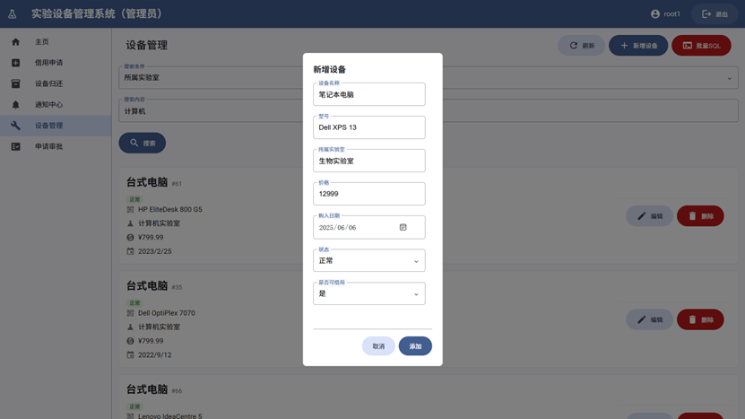

# 实验设备管理系统（MySQL+Flask）

[](https://opensource.org/licenses/MIT)

一个用于管理实验设备的系统。使用MySQL数据库、Flask后端以及基于HTML、CSS和JavaScript构建的轻量级Web界面。能够实现多角色用户管理、设备按条件查询与操作、完成操作发送通知、审批等功能。网页适配各尺寸屏幕的显示。

## Contributors

| [darrindeyoung791](https://github.com/darrindeyoung791) | 项目发起者，组长；数据库结构设计；网页界面设计；版本管理；文档维护。 |
| ------------------------------------------------------- | ------------------------------------------------------------ |
| [ying8502](https://github.com/ying8502)                 | 参与者；数据库结构设计；网页架构设计。                       |
| [Frozentime3](https://github.com/Frozentime3)           | 参与者；资料搜集；文档维护。                                 |

## 效果图

以下为部分页面截图，更多示例图片见`/img`下的图片

<div align="center">


<br>

<br>

<br>

<br>


</div>

## 全部功能模块

1. 用户管理模块
    1. 多角色管理
        - 学生和管理员
        - 不同身份对应不同功能和权限
    2. 账号注册和登录
        - 可以在登录界面注册新学生账号
    3. 密码管理
        - 用户数据表仅存放密码的哈希值，不传输或存储明文
2. 主页模块
    1. 直达各功能模块
    2. 可以退出账号登录
3. 各功能模块
    1. 借用设备
        - 学生先搜索可借用的设备，再对所需设备发出借用申请
        - 经过管理员审批后才可以使用设备。审批通过或不通过会收到通知
        - 管理员可以不经审批环节直接借到设备
    2. 归还设备
        - 列出所有当前用户已借用的设备，可以选择归还
        - 也列举出已申请借用但未审批的设备，若不需要可以在审批前取消申请
    3. 通知中心
        - 可以查看通知，包括：
            - 审批成功
            - 审批不成功
            - 有请求待审批（管理员）
        - 可以一键全部已读
    4. 设备管理（管理员）
        - 管理员可以在此处新增设备、编辑现有设备、删除现有设备
        - 管理员先搜索全部设备，再编辑和删除
        - 删除有防误触机制，需要输入一次设备型号才能删除（参考 GitHub 删库的设计）
        - 管理员可以使用图形化方式管理设备，也可以在此处使用批量 SQL 命令操作数据库
    5. 申请审批（管理员）
        - 管理员可以在此处审批来自学生的设备使用申请
        - 管理员可以看到学生信息、设备信息，设备剩余量等信息
        - 管理员可以拒绝或同意申请，同意申请需要分配设备借用时长
4. 子模块（不向用户单独暴露）
    1. Layout 模块
        - 所有功能页面的网页模板
        - 所有功能集成在侧栏中，用户无需先返回主页再选择功能
        - 当页面可以滚动时，右下角出现返回顶部的 FAB 按钮
        - 在宽屏幕下侧栏常驻，窄屏幕（如手机）下侧栏变为可折叠式
    2. 设备搜索模块
        - 单一条件搜索（暂不支持多条件搜索或从结果中搜索）
        - 按设备字段搜索，全部采用模糊搜索（例如，输入“笔记本”也会返回“笔记本电脑”的搜索结果）
        - 自定义操作，例如：
            - 借用界面调用搜索只展示“可借用”设备，搜索结果的操作是“申请借用”
            - 设备管理界面调用搜索展示全部设备，搜索结果的操作可以是“编辑”和“删除”
5. 数据库模块
    1. 用户表
    2. 设备表
    3. 借用记录表
    4. 审批记录表
    5. 日志表
    6. 通知表


## 数据库设计

### 1. `users` 表

> 存放全部用户数据

```plaintext
user_id          INT AUTO_INCREMENT PRIMARY KEY, -- 用户唯一标识
username         VARCHAR(50) NOT NULL,           -- 用户名，用于登录
pswd_hash        VARCHAR(255) NOT NULL,          -- 加密后的密码哈希值
user_type        INT NOT NULL,                   -- 用户类型（1: 学生, 2: 教师, 3: 管理员）
name             VARCHAR(100) NOT NULL,          -- 用户姓名
gender           INT NOT NULL,                   -- 性别（1: 男, 2: 女）
dpt              VARCHAR(100),                   -- 所属院系或专业
title            VARCHAR(100),                   -- 职称
status           INT NOT NULL                    -- 用户状态（1: 正常, 2: 毕业, 3: 离职等）
```

### 2. `devices` 表

> 存放全部设备数据

```plaintext
device_id        INT AUTO_INCREMENT PRIMARY KEY, -- 设备唯一标识
device_name      VARCHAR(100) NOT NULL,          -- 设备名称
model            VARCHAR(100) NOT NULL,          -- 设备型号
purchase_date    DATE NOT NULL,                  -- 购入时间
price            DECIMAL(10, 2) NOT NULL,        -- 设备价格
status           INT NOT NULL,                   -- 设备状态（1: 正常, 2: 需要维修, 3: 维修中, 4: 报废）
lab              VARCHAR(100) NOT NULL,          -- 所属实验室
can_borrow       INT NOT NULL                    -- 是否可以借用（1: 是, 0: 否）
```

### 3. `borrow_records` 表

> 借用记录表

```plaintext
record_id        INT AUTO_INCREMENT PRIMARY KEY, -- 借还记录唯一标识
user_id          INT NOT NULL,                   -- 借用人ID，关联到`users`表
device_id        INT NOT NULL,                   -- 借用设备ID，关联到`devices`表
borrow_date      DATE NOT NULL,                  -- 借用日期
return_date      DATE,                           -- 归还日期，如果尚未归还则为NULL
return_deadline  DATE,                           -- 归还截止日期
approval_status  INT NOT NULL                    -- 审批状态（1: 待审批, 2: 已批准, 3: 已拒绝）
approver_id      INT,                            -- 审批人ID，关联到`users`表
```

### 4. `approval_records` 表

> 审批记录表

```plaintext
approval_id      INT AUTO_INCREMENT PRIMARY KEY, -- 审批记录唯一标识
record_id        INT NOT NULL,                   -- 关联到`borrow_records`表的借还记录ID
approver_id      INT NOT NULL,                   -- 审批人ID，关联到`users`表
approval_date    DATE NOT NULL,                  -- 审批日期
approval_comment TEXT                            -- 审批意见，如拒绝原因等
```

### 5. `logs` 表

> 日志表，可能可以不设计

```plaintext
log_id           INT AUTO_INCREMENT PRIMARY KEY, -- 日志记录唯一标识
user_id          INT NOT NULL,                   -- 操作用户ID，关联到`users`表
action           INT NOT NULL,                   -- 操作类型（1: 设备更新, 2: 用户删除等）
details          TEXT,                           -- 操作详情，如具体更新了哪些字段
timestamp        TIMESTAMP DEFAULT CURRENT_TIMESTAMP -- 操作发生的时间
```

### 6. `notifications` 表

> 存放系统通知

```plaintext
notification_id  INT AUTO_INCREMENT PRIMARY KEY, -- 通知唯一标识
user_id          INT NOT NULL,                   -- 接收通知的用户ID
type            INT NOT NULL,                    -- 通知类型（1: 审批通过, 2: 审批拒绝, 3: 归还提醒, 4: 维修完成）
content         TEXT NOT NULL,                   -- 通知内容
related_id      INT,                            -- 相关记录ID（如借用记录ID）
created_at      TIMESTAMP DEFAULT CURRENT_TIMESTAMP, -- 通知创建时间
read_status     INT NOT NULL DEFAULT 0,         -- 阅读状态（0: 未读, 1: 已读）
FOREIGN KEY (user_id) REFERENCES users(user_id)
```


## ER 图


## 网页设计


| **中文名**           | **英文名**      | **完成状态** |
| -------------------- | --------------- | ------------ |
| 登录页               | `login`         | ✔️            |
| 注册页               | `sign_up`       | ✔️            |
| 主页                 | `index`         | ✔️            |
| 申请借用             | `borrow`        | ✔️            |
| 归还                 | `return`        | ✔️            |
| 通知中心             | `notifications` | ✔️            |
| 查询与编辑（管理员） | `edit_devices`  | ✔️            |
| 审批（管理员）       | `review`        | ✔️            |

### 变动一

不再单独提供查询页面

可以注意到：

- 借用本质上是**先查询可用设备**，再借用
- 归还本质上是**先查询已借设备**，再归还
- 编辑设备信息和删除设备本质上是**先查询全部设备**，再操作

因此，**按条件查询是一个已经包含在大多数过程里的过程**，需要多次复用，无需独立存在。并且用户事实上不用关心全部的实验设备的信息，只需要关心如何对所预期的设备进行操作

### 变动二

新增设备最终纳入编辑设备，虽然新增设备不需要查询，但逻辑上与编辑已有设备的信息和删除已有设备是同一类操作

### 变动三

借用和归还现已拆分为两个页面。在变动一里提到过，两者需要查询的范围是不同的。先前合并两者并且与查询独立放置的举动是没有道理的


## 部署运行

### 一、配置 Python 虚拟环境

推荐使用虚拟环境进行部署：

```bash
# 创建虚拟环境
python -m venv venv

# 激活虚拟环境
source venv/bin/activate  # Linux/Mac
# 或
.\\venv\scripts\activate  # Windows PowerShell

# 更新pip并安装依赖
python -m pip install --upgrade pip
pip install -r requirements.txt
```

当前开发环境是 Windows 11 23H2 下的 Python 3.9，如果在其他环境中部署出现错误，请提 issue 或者咨询 AI


### 二、配置 MySQL 数据库

```sql
-- 创建数据库
CREATE DATABASE IF NOT EXISTS equipment_mgr;
USE equipment_mgr;

-- 创建 users 表
CREATE TABLE IF NOT EXISTS users (
    user_id INT AUTO_INCREMENT PRIMARY KEY,
    username VARCHAR(50) NOT NULL,
    pswd_hash VARCHAR(255) NOT NULL,
    user_type INT NOT NULL,
    name VARCHAR(100) NOT NULL,
    gender INT NOT NULL,
    dpt VARCHAR(100),
    title VARCHAR(100),
    status INT NOT NULL
);

-- 创建 devices 表
CREATE TABLE IF NOT EXISTS devices (
    device_id INT AUTO_INCREMENT PRIMARY KEY,
    device_name VARCHAR(100) NOT NULL,
    model VARCHAR(100) NOT NULL,
    purchase_date DATE NOT NULL,
    price DECIMAL(10, 2) NOT NULL,
    status INT NOT NULL,
    lab VARCHAR(100) NOT NULL,
    can_borrow INT NOT NULL
);

-- 创建 borrow_records 表
CREATE TABLE IF NOT EXISTS borrow_records (
    record_id INT AUTO_INCREMENT PRIMARY KEY,
    user_id INT NOT NULL,
    device_id INT NOT NULL,
    borrow_date DATE NOT NULL,
    return_date DATE,
    return_deadline DATE,
    approval_status INT NOT NULL,
    approver_id INT,
    FOREIGN KEY (user_id) REFERENCES users(user_id),
    FOREIGN KEY (device_id) REFERENCES devices(device_id),
    FOREIGN KEY (approver_id) REFERENCES users(user_id)
);

-- 创建 approval_records 表
CREATE TABLE IF NOT EXISTS approval_records (
    approval_id INT AUTO_INCREMENT PRIMARY KEY,
    record_id INT NOT NULL,
    approver_id INT NOT NULL,
    approval_date DATE NOT NULL,
    approval_comment TEXT,
    FOREIGN KEY (record_id) REFERENCES borrow_records(record_id),
    FOREIGN KEY (approver_id) REFERENCES users(user_id)
);

-- 创建 logs 表
CREATE TABLE IF NOT EXISTS logs (
    log_id INT AUTO_INCREMENT PRIMARY KEY,
    user_id INT NOT NULL,
    action INT NOT NULL,
    details TEXT,
    timestamp TIMESTAMP DEFAULT CURRENT_TIMESTAMP,
    FOREIGN KEY (user_id) REFERENCES users(user_id)
);

-- 创建 notifications 表
CREATE TABLE IF NOT EXISTS notifications (
    notification_id INT AUTO_INCREMENT PRIMARY KEY,
    user_id INT NOT NULL,
    type INT NOT NULL,
    content TEXT NOT NULL,
    related_id INT,
    created_at TIMESTAMP DEFAULT CURRENT_TIMESTAMP,
    read_status INT NOT NULL DEFAULT 0,
    FOREIGN KEY (user_id) REFERENCES users(user_id)
);

```

添加用户：

```sql
CREATE USER 'equipment_mgr'@'localhost' IDENTIFIED BY 'your_password_here';
GRANT ALL PRIVILEGES ON equipment_mgr.* TO 'equipment_mgr'@'localhost';
FLUSH PRIVILEGES;
```


### 三、配置 .env 文件

项目支持通过`.env`文件配置数据库连接等敏感信息。请在项目根目录下新建`.env`文件，内容示例：

```
# .env 示例
MYSQL_HOST=localhost
MYSQL_USER=equipment_mgr
MYSQL_PASSWORD=your_password_here
MYSQL_DB=equipment_mgr
MYSQL_PORT=3306
SECRET_KEY=your_secret_key_here
```

- `MYSQL_HOST`：数据库主机地址，通常为`localhost`
- `MYSQL_USER`：数据库用户名
- `MYSQL_PASSWORD`：数据库密码
- `MYSQL_DB`：数据库名
- `MYSQL_PORT`：端口，默认3306
- `SECRET_KEY`：Flask会话密钥，请自行设置为随机字符串

确保`.env`文件已被`.gitignore`忽略，避免敏感信息泄露。

### 四、运行

```bash
python app.py
```

